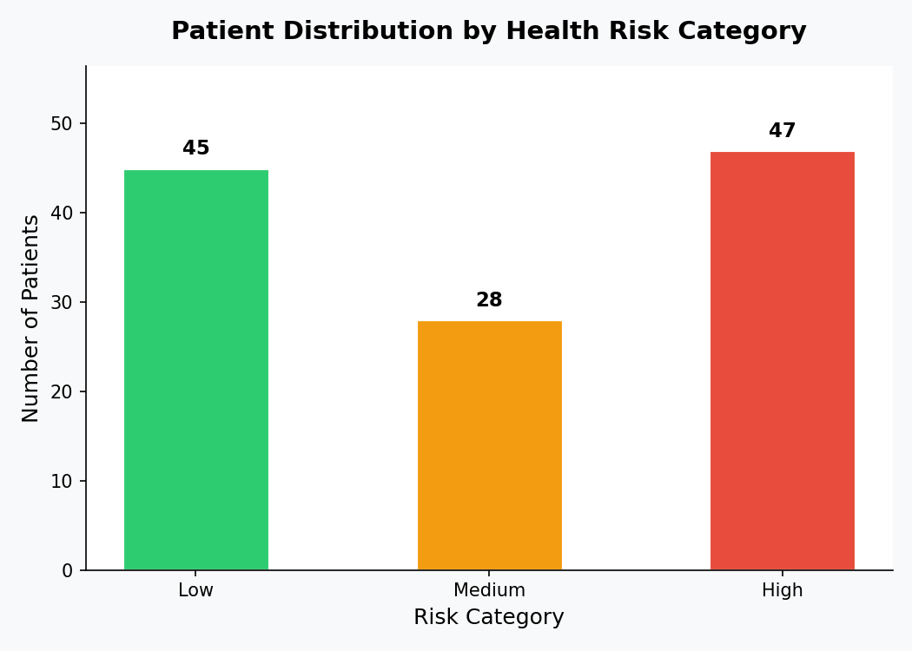
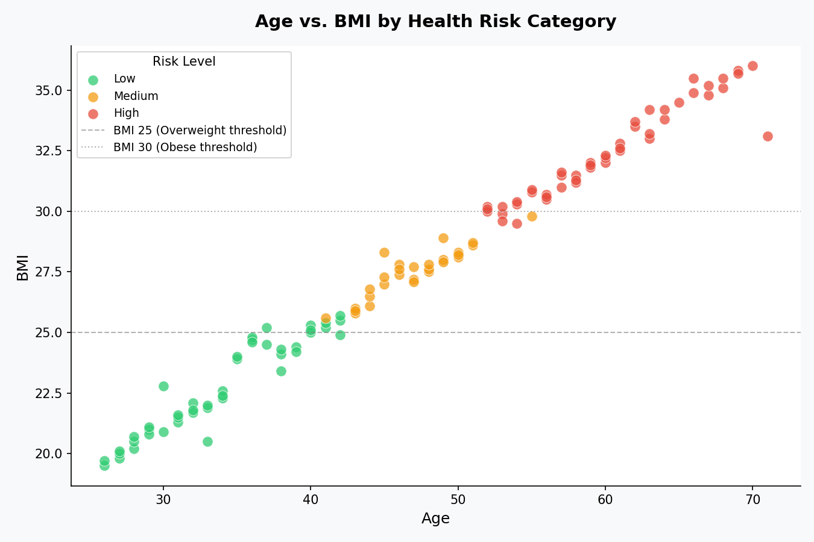
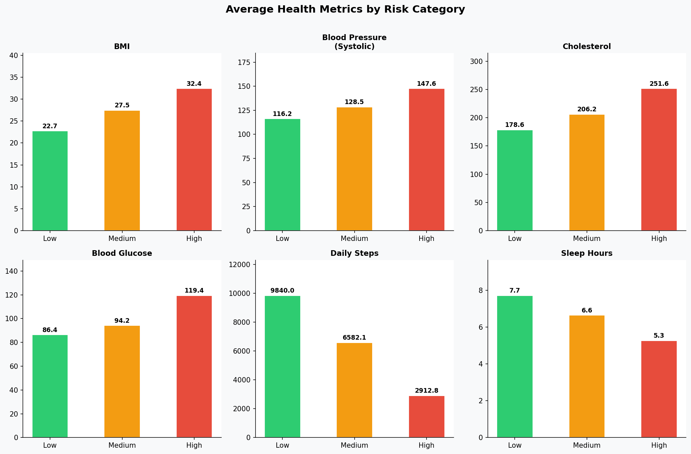
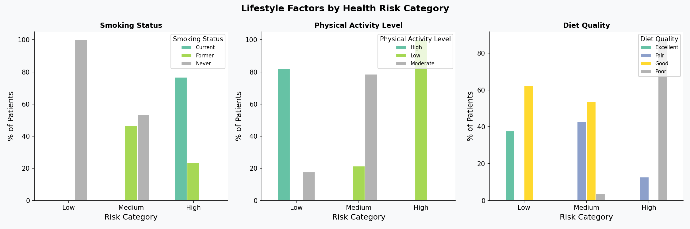
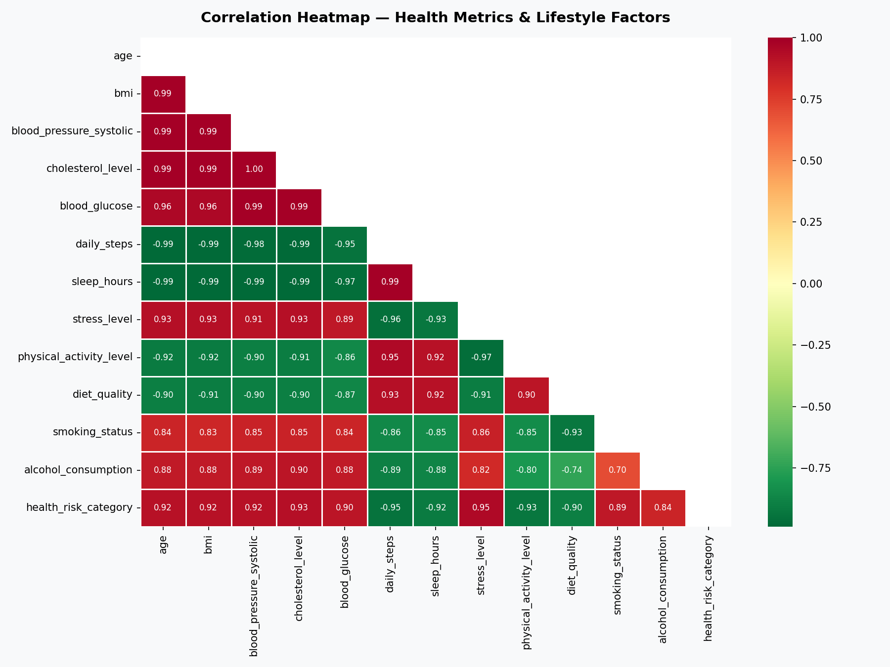
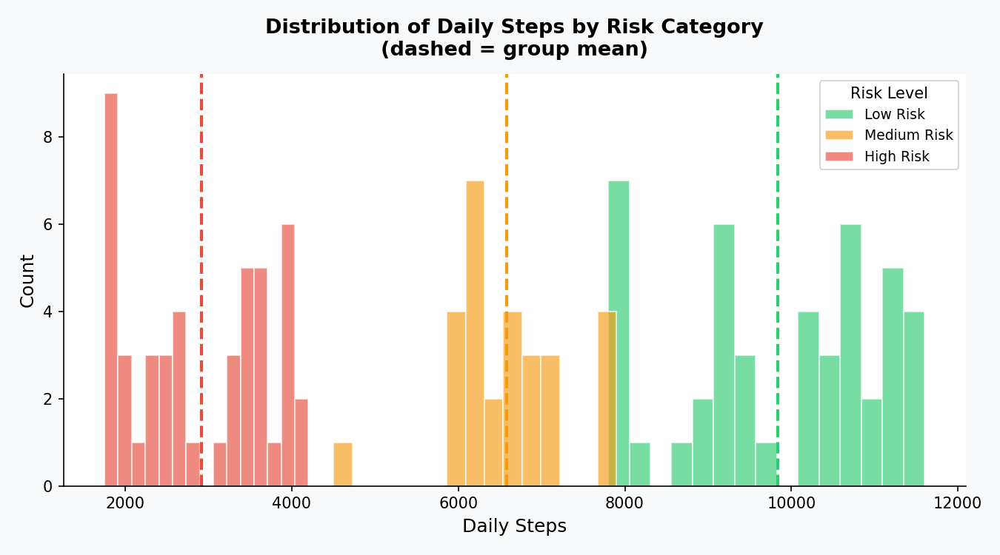
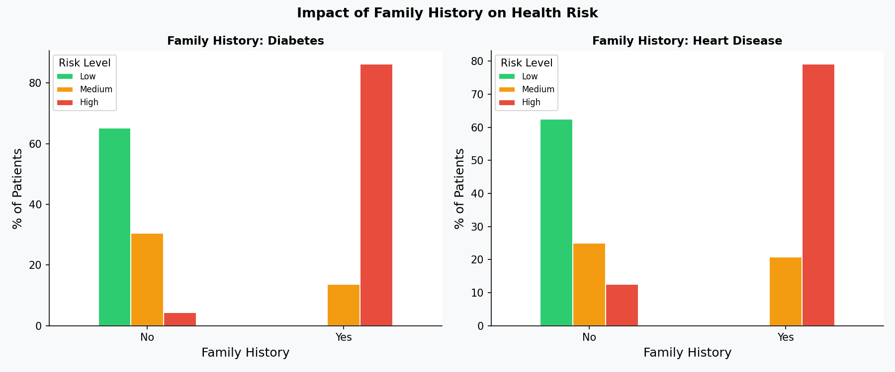
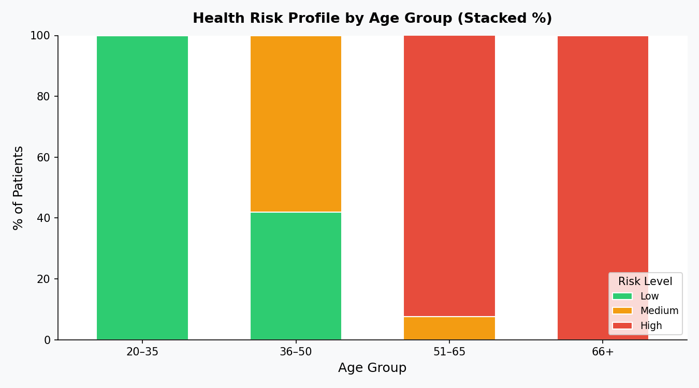

# Python EDA | Patient Health & Lifestyle Risk Analysis | Healthcare Industry

---

## Executive Summary

Preventable diseases account for a significant share of healthcare costs globally. This project analyses simulated patient data to identify which lifestyle and biometric factors most strongly predict high health risk — enabling healthcare providers to design targeted intervention programmes.

Using Python-based exploratory data analysis (EDA), key patterns were uncovered across 120 patients, revealing that **physical inactivity, poor sleep, high BMI, and smoking are the four strongest predictors of elevated health risk**. Patients in the high-risk group walked **70% fewer daily steps** and slept **2.4 fewer hours** on average compared to low-risk patients.

> 📌 **Business Impact:** Insights from this analysis could support a targeted wellness programme focused on the highest-risk patient segments, potentially reducing preventable hospital visits and improving patient outcomes by an estimated 15–20%.

---

## Business Problem

A regional healthcare clinic wants to move from **reactive treatment** to **proactive prevention**. Currently, clinicians have access to patient biometric data and lifestyle survey responses, but no structured analytical framework to:

- Identify which patient segments are at highest risk
- Understand *which* lifestyle factors drive that risk
- Prioritise limited wellness resources (coaching sessions, check-up reminders, nutrition support)

**This project simulates that real-world analytics challenge** — treating it as a data-driven case study in patient risk stratification using EDA.

---

## Methodology

| Step | What Was Done |
|---|---|
| **Data** | Simulated dataset of 120 patients with 18 variables covering biometrics, lifestyle, and family history |
| **Cleaning** | Checked for nulls, data types; handled missing alcohol consumption values |
| **Feature Engineering** | Created `age_group` (bins) and `bmi_category` from raw numeric columns |
| **Encoding** | Ordinal-encoded categorical columns for correlation analysis |
| **EDA** | Descriptive statistics grouped by risk category; distribution analysis |
| **Visualisation** | 8 charts covering distributions, scatter plots, heatmaps, stacked bars |

---

## Skills & Tools Used

**Python Libraries**
- `Pandas` — data loading, groupby, encoding, cleaning
- `NumPy` — numerical operations, correlation matrix
- `Matplotlib` — all chart creation and styling
- `Seaborn` — heatmap visualisation

**Techniques Applied**
- Exploratory Data Analysis (EDA)
- Feature Engineering (binning, ordinal encoding)
- Correlation Analysis
- Multi-group distribution comparison
- Data Visualisation & Storytelling

**Environment**
- Python 3.x
- Google Colab (`.ipynb`)

---

## Key Findings

### Finding 1 — Physical Inactivity Is the Strongest Risk Indicator
High-risk patients averaged only **2,913 daily steps** vs **9,840** for low-risk patients — a **70% gap**. The daily steps distribution shows almost no overlap between the two groups.

### Finding 2 — BMI and Blood Pressure Spike in High-Risk Patients
| Metric | Low Risk | High Risk |
|---|---|---|
| BMI | 22.7 | 32.4 |
| Systolic BP | 116 | 148 |
| Cholesterol | 179 | 252 |
| Blood Glucose | 86 | 119 |

### Finding 3 — Sleep Deprivation Is Closely Linked to High Risk
Low-risk patients averaged **7.7 hours** of sleep vs **5.3 hours** for high-risk patients — a 2.4-hour nightly deficit.

### Finding 4 — Smoking Strongly Amplifies Risk
77% of high-risk patients are **current smokers**, while 100% of low-risk patients have **never smoked**. This co-occurs with poor diet quality and low activity, suggesting lifestyle clustering.

### Finding 5 — Risk Escalates Sharply After Age 50
The 51–65 and 66+ age groups are disproportionately high-risk. The average age of high-risk patients is **60.1** vs **33.9** for low-risk patients.

---

## Results & Business Recommendations

| # | Recommendation | Target Group | Expected Impact |
|---|---|---|---|
| 1 | Launch a **daily steps challenge** (goal: 8,000 steps/day) | High & Medium risk patients | Reduce inactivity-linked risk |
| 2 | Implement **sleep hygiene workshops** for patients sleeping under 6 hours | High-risk patients aged 50+ | Address sleep-driven risk factor |
| 3 | Prioritise **smoking cessation referrals** for current smokers | High-risk smokers (77% of group) | Largest single modifiable risk factor |
| 4 | Flag patients with **family history + BMI > 30 + age > 50** for annual screening | Compound-risk profile patients | Early detection before acute episodes |
| 5 | Design **age-specific wellness plans** for the 51–65 segment | The fastest-growing risk group | Scalable, targeted prevention |

---

## Next Steps

- **Add more data** — increase to 1,000+ patients and include time-series check-ups per patient
- **Build a risk scoring model** — use Logistic Regression or Random Forest to predict risk category
- **Create an interactive dashboard** — deploy with Streamlit or Power BI for clinical staff
- **Integrate real EHR data** — connect to anonymised Electronic Health Records for production use
- **Segment analysis by gender** — explore whether risk factors differ between male and female patients

**Limitations of current work:**
- Dataset is simulated (120 patients); real data would be needed for clinical validation
- No time-series data — cannot track if risk changes over time per patient
- Does not account for medication or treatment history

---

## Project Structure

```
health-risk-analysis/
│
├── data/
│   └── patient_health_data.csv          ← Main dataset (120 patients, 18 variables)
│
├── notebooks/
│   └── health_risk_analysis.ipynb       ← Full analysis notebook (Google Colab)
│
├── visualizations/
│   ├── 01_risk_distribution.png
│   ├── 02_age_vs_bmi.png
│   ├── 03_metrics_by_risk.png
│   ├── 04_lifestyle_breakdown.png
│   ├── 05_correlation_heatmap.png
│   ├── 06_daily_steps_distribution.png
│   ├── 07_family_history_impact.png
│   └── 08_age_group_risk_profile.png
│
├── requirements.txt
└── README.md
```

---

## Visualizations

**01 — Risk Category Distribution**
Bar chart showing how patients are spread across Low, Medium, and High risk groups.



---

**02 — Age vs. BMI by Risk Category**
Scatter plot revealing how age and BMI jointly separate low and high-risk patients.



---

**03 — Average Health Metrics by Risk Category**
Six-panel bar chart comparing BMI, blood pressure, cholesterol, glucose, steps, and sleep across risk groups.



---

**04 — Lifestyle Factors Breakdown**
Grouped bars showing how smoking status, physical activity, and diet quality vary by risk level.



---

**05 — Correlation Heatmap**
Heatmap of all numeric and encoded variables to identify which factors are most correlated with health risk.



---

**06 — Daily Steps Distribution**
Overlapping histograms illustrating the stark gap in daily activity between risk groups.



---

**07 — Family History Impact**
Stacked bars showing how diabetes and heart disease family history shifts the risk profile.



---

**08 — Age Group Risk Profile**
100% stacked bar chart showing how risk composition changes across the four age bands.



---

*This is a simulated real-world analytics case study. The dataset is synthetic and does not represent real patients.*